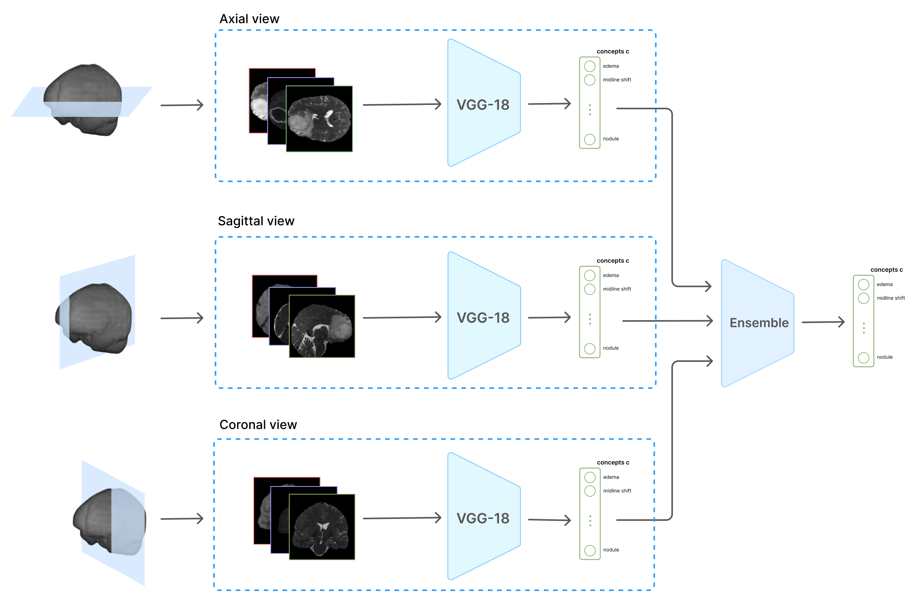
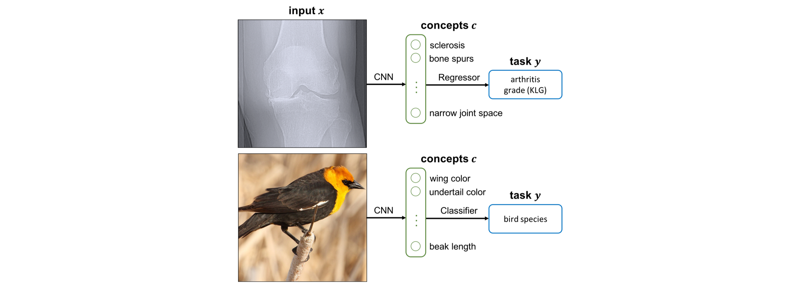
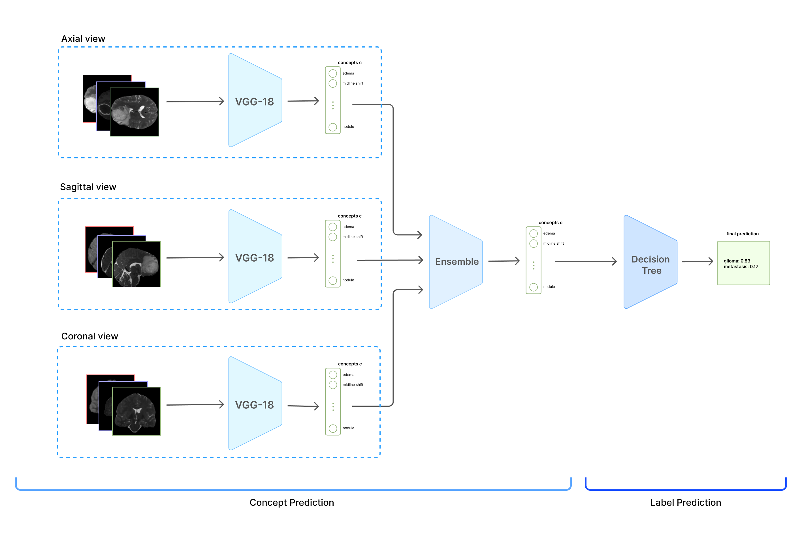

# 🧠 Interpretable Brain Tumor Diagnosis from MRI Scans

My dissertation project explores a more **interpretable** approach to diagnosing brain tumors from MRI scans. While deep learning models have demonstrated high accuracy in medical imaging, they often function as **"black boxes"**, providing little insight into *why* certain predictions are made. The goal of the project is to **preserve predictive performance** while introducing **clinically meaningful explanations**, which is crucial for adoption in **high-stakes medical settings**.

*Overview of Concept Encoder architecture*

## Motivation

Differentiating **glioblastomas** from **brain metastases** is particularly challenging because both can appear as **irregular, contrast-enhancing lesions** on MRI scans. However, their treatment strategies differ significantly, so it is crucial to make the correct diagnosis.

Many AI models **outperform clinicians** in classification accuracy but fail to provide **clear decision rationales**, limiting their **trustworthiness**. Post-hoc explainability techniques (e.g., **Grad-CAM, LIME, SHAP**) can highlight *where* a model is looking but **not what it recognises** (e.g., “Is this region **edema** or just image noise?”).  

## The Proposed Solution: Concept Bottleneck Models (CBMs)

Concept Bottleneck Models (**CBMs**) tackle this explainability gap by **explicitly structuring the model around clinically relevant concepts**. Instead of mapping MRI scans **directly** to a diagnosis, our approach introduces an **interpretable intermediate layer**:

*Concept Bottleneck Architecture (From Koh et al. 2020)*

### The architecture consists of two main stages:
1. **Concept Encoder** → Learns to identify **clinically meaningful features** (e.g., **edema, ring enhancement, necrosis**) from MRI images.
2. **Label Predictor** → Uses **only these extracted concepts** to classify the tumor as **glioma** or **metastasis**.

## Project Overview

### Dataset  
- **BraTS**: Multi-modal MRI dataset including **T1, T1CE, T2, FLAIR** sequences.  
- **Rad Genome**: Radiology reports describing key tumor features (used for concept extraction).

### Concept Extraction  
- I worked with **clinicians** to select **key diagnostic features** (e.g., "ring enhancement," "edema").  
- These **features are automatically extracted** from **radiology reports** and used to train the **Concept Encoder**.

### Model Architecture  

#### **1. Concept Encoder**

*Overview of Concept Encoder architecture*
- **Three VGG-16 networks** process MRI scans from **axial, sagittal, and coronal** views.
- Each network predicts **likelihoods of clinically defined features**.

#### **2. Label Predictor**
- Uses **only concept scores** to classify the tumor type (**glioma vs. metastasis**).  

**Full CBM Architecture:**

